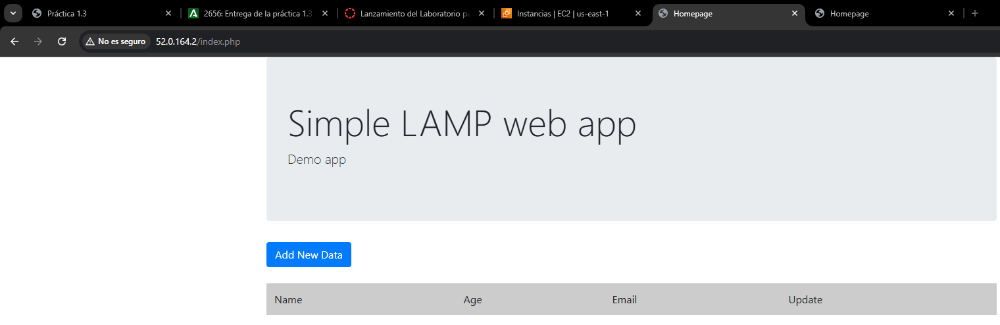

# Practica1-3
En esta práctica se llevará a cabo el despliegue de una aplicación web utilizando la pila LAMP sobre una instancia EC2 de AWS. 

Trataremos de configurar y automatizar la instalación de cada componente de la pila LAMP en la instancia de Ubuntu Server, permitiendo que una aplicación web propuesta esté completamente operativa y accesible desde un navegador web


##
# Estructura

``` bash
Practica1-3

├── conf
│   └── 000-default.conf    
├── php
│   └── index.php          
└── scripts
    ├── .env                
    ├── install_lamp.sh      
    └── deploy.sh 

```

## 
# Descripción de las carpetas y archivos:
### php/:
Esta carpeta contiene el archivo index.php, que suele utilizarse para verificar si PHP esta correctamente configurado

### scripts/:
Esta carpeta almacena scripts de automatización que facilitan la instalación y configuración del servidor

### install_lamp.sh: 
Un script bash que instala la pila LAMP

### .env: 
Un archivo de configuración que almacena variables de entorno utilizadas por los scripts

### deploy.sh
Es el script que despliegua los pasos necesarios para instalar y configurar una aplicación web en un servidor con la pila LAMP

### 000-default.conf
La configuración por defecto para un Virtual Host de Apache
##


# Guía de Instalación para install_lamp.sh
Este script instala y configura la pila LAMP


``` bash
#!/bin/bash

## Muestra los comandos y para cuando hay un error
set -ex

## Actualización de repositorios
apt update

## Instalación del servidor apache
apt install apache2 -y

## Reiniciar apache
sudo systemctl restart apache2

## Habilitamos el módulo de reescritura de Apache
a2enmod rewrite

## Copiamos el archivo de configuración de Apache
cp ../conf/000-default.conf /etc/apache2/sites-available

## Instalación de PHP y módulos necesarios
apt install php libapache2-mod-php php-mysql -y

## Instalación de MySQL Server
apt install mysql-server -y

## Reiniciar Apache para aplicar cambios
sudo systemctl restart apache2

## Copiamos el script de prueba PHP en /var/www/html
cp ../php/index.php /var/www/html

## Cambiamos el propietario de /var/www/html a www-data
chown -R www-data:www-data /var/www/html

```

# Guía de Instalación para deploy.sh
Este script se encarga de automatizar el despliegue de una aplicación web en un servidor configurado con la pila LAMP

``` bash
#!/bin/bash

# Importamos el archivo de variables
source .env

# Muestra los comandos y se detiene si hay un error
set -ex

# Eliminamos clonados previos de la aplicación
rm -rf /tmp/iaw-practica-lamp

# Clonamos el repositorio de la aplicación
git clone https://github.com/josejuansanchez/iaw-practica-lamp.git /tmp/iaw-practica-lamp

# Movemos el código fuente de la aplicación a /var/www/html
mv /tmp/iaw-practica-lamp/src/* /var/www/html

# Configuramos el archivo config.php con las credenciales de la base de datos
sed -i "s/database_name_here/$DB_NAME/" /var/www/html/config.php
sed -i "s/username_here/$DB_USER/" /var/www/html/config.php
sed -i "s/password_here/$DB_PASSWORD/" /var/www/html/config.php

# Importar script SQL para configurar la base de datos
mysql -u root <<<"DROP DATABASE IF EXISTS $DB_NAME"
mysql -u root <<<"CREATE DATABASE $DB_NAME"

# Crear el usuario en la base de datos y asignar permisos
mysql -u root <<< "DROP USER IF EXISTS '$DB_USER'@'%'"
mysql -u root <<< "CREATE USER '$DB_USER'@'%' IDENTIFIED BY '$DB_PASSWORD'"
mysql -u root <<< "GRANT ALL PRIVILEGES ON $DB_NAME.* TO '$DB_USER'@'%'"

# Configuramos el script SQL con el nombre de la base de datos
sed -i "s/lamp_db/$DB_NAME/" /tmp/iaw-practica-lamp/db/database.sql

# Crear las tablas y estructura de la base de datos
mysql -u root < /tmp/iaw-practica-lamp/db/database.sql

```
# Guía de Configuración para .env
El archivo .env almacena los datos y otros valores de configuración que se usarán en los scripts de despliegue

``` bash
PHPMYADMIN_APP_PASSWORD=usuario
DB_USER=usuario
DB_PASSWORD=usuario
DB_NAME=basededatos

```
# 
# Comprobaciones
Al poner la ip elastica de nuestra instacia sin haber instalado todavia el deploy.sh debe aparecer esto:


#

Y al haber instalado el deploy.sh junto con el install_lamp.sh pondremos otra vez nuestra ip elastica y nos debera aparecer esto:



#